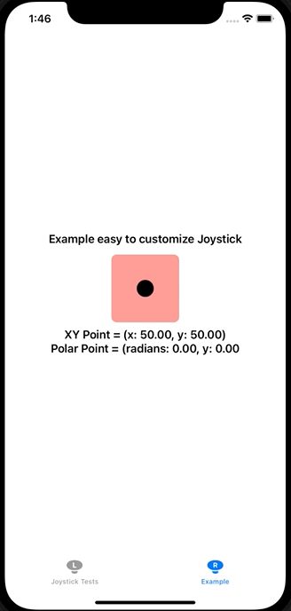
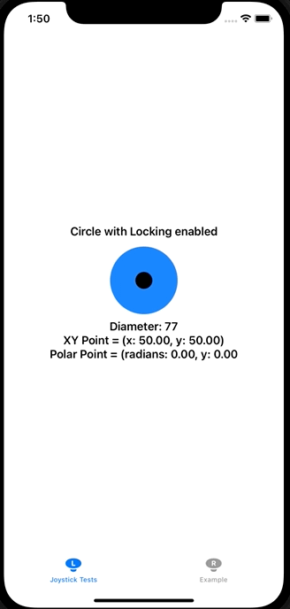

# SwiftUIJoystick
## A customizable Joystick made with SwiftUI
## Create your own Base and Thumb/Handle view using SwiftUI
 
- [Installation](#how-to-install)
  - [Swift Package Manager](#swift-package-manager-spm)
  - [Cocoapods](#cocoapods)
- [🛠 How to use](#how-to-use)
  - [Example Code](#examle-code)
- [🛠 How to Customize](#how-to-customize)
  - [Setup Joystick Monitor](#setup-a-joystick-monitor)
  - [Use Joystick Builder](#option-1)
  - [Use Joystick Recognizer](#option-2)
- [👨‍💻 Contributors](#-contributors)
- [✍️ Author](#-author)
- [📃 License](#-license)
- [📦 Projects](#-projects)

### Normal Joystick Example <a href="https://github.com/michael94ellis/SwiftUIJoystick/blob/main/SwiftUIJoystickApp/ExampleJoystick.swift">(View Code Example)</a>
#### View this example to see how to make a Joystick Control View Object for your app!
<p align="center">
  
</p>
 
### Locking Joystick Example <a href="https://github.com/michael94ellis/SwiftUIJoystick/blob/main/SwiftUIJoystickApp/TestingView.swift#L30-L40">(View Code Example)</a>
<p align="center">
  
</p>
  
### Multiple Joystick Examples <a href="https://github.com/michael94ellis/SwiftUIJoystick/blob/main/SwiftUIJoystickApp/TestingView.swift">(View Code Example)</a>
<p align="center">
  
</p>

# How to Install

### Swift Package Manager SPM
Add this repository's URL
`https://github.com/michael94ellis/SwiftUIJoystick`

### Cocoapods
Add this line to your podfile
`pod SwiftUIJoystick`


# How to use
### Example Code: 
### Ready to Copy, Paste, and Use (after install with SPM or Pods)

```Swift
// An example Joystick
// Copy this example and modify it

import SwiftUI
import SwiftUIJoystick

public struct Joystick: View {
    
    /// The monitor object to observe the user input on the Joystick in XY or Polar coordinates
    @ObservedObject public var joystickMonitor: JoystickMonitor
    /// The width or diameter in which the Joystick will report values
    ///  For example: 100 will provide 0-100, with (50,50) being the origin
    private let dragDiameter: CGFloat
    /// Can be `.rect` or `.circle`
    /// Rect will allow the user to access the four corners
    /// Circle will limit Joystick it's radius determined by `dragDiameter / 2`
    private let shape: JoystickShape
    
    public init(monitor: JoystickMonitor, width: CGFloat, shape: JoystickShape = .rect) {
        self.joystickMonitor = monitor
        self.dragDiameter = width
        self.shape = shape
    }
    
    public var body: some View {
        VStack{
            JoystickBuilder(
                monitor: self.joystickMonitor,
                width: self.dragDiameter,
                shape: .rect,
                background: {
                    // Example Background
                    RoundedRectangle(cornerRadius: 8).fill(Color.red.opacity(0.5))
                },
                foreground: {
                    // Example Thumb
                    Circle().fill(Color.black)
                },
                locksInPlace: false)
        }
    }
}
```

# How to customize
## Start by making a JoystickMonitor
You can subscribe to changes
### Use a JoystickBuilder to build your own Joystick Controls' Background/Base and Thumb/Foreground views

## Setup a Joystick Monitor
#### Setup the observer JoystickMonitor and width of the joystick
```
    @StateObject private var monitor = JoystickMonitor(width: 100)
    private let draggableDiameter: CGFloat = 100
```

## Option 1
#### Create the Joystick using the Joystick Builder
Joystick Builder applies the joystickGestureRecognizer
```
    JoystickBuilder(
        monitor: self.joystickMonitor,
        width: self.draggableDiameter,
        shape: .rect,
        background: {
            // Example Background
            RoundedRectangle(cornerRadius: 8).fill(Color.red.opacity(0.5))
        },
        foreground: {
            // Example Thumb
            Circle().fill(Color.black)
        },
        locksInPlace: false)
```

## Option 2
#### Create your own Joystick tracking View with the JoystickRecognizer
Apply the joystickGestureRecognizer to any of your views to receive updates on the monitor
```
        YourView()
            .joystickGestureRecognizer(monitor: self.joystickMonitor, width: self.width, shape: self.controlShape, locksInPlace: self.locksInPlace)
```

### Parameters

| parameter    | type            | description                                                                    | default  |
| ---------    | --------------- | ------------------------------------------------------------------------------ | -------- |
| monitor      | JoyStickMonitor | ObservableObect that publishes the Joystick control's XY and Polar coordinates | no       |
| width        | CGFloat         | The width or diameter of the Joystick control                                  | no       |
|              |                 | Output values will be from 0-width                                             |          |
| shape        | JostickShape    | The shape of the Joystick's hitbox area, rectangluar or circular       Valid input: `.rect` or `.circle`  | no       |
| background   | some View       | Any View type input can be put here to create a background for the Joystick    | no       |
| foreground   | some View       | A View for the thumb or foreground of the Joystick                             | no       |
| locksInPlace | Bool            | A bool to determine if the Joystick resets back to the center when release     | no       |
